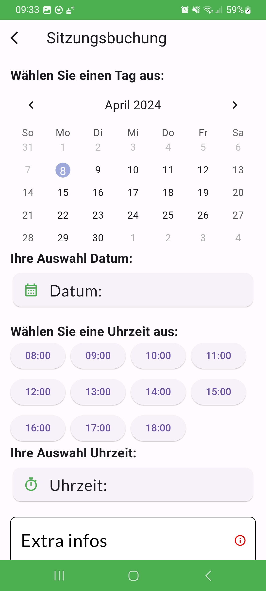
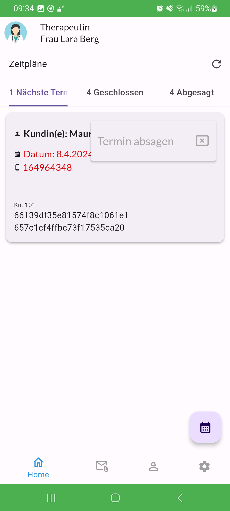
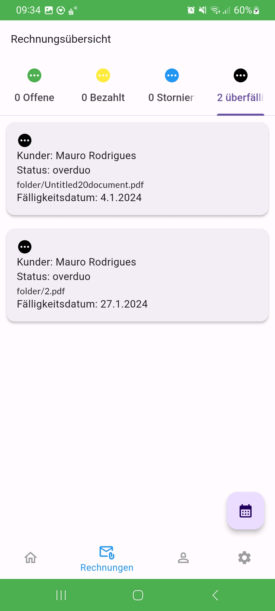

# Mauro Sergio Rodrigues da Silva Portfolio

# Benutzer-App for Therapy

Welcome to the User-App for therapy, an application designed to help you improve your mental health and well-being.

## Overview

The User-App offers a variety of features and resources to help you cope with stress, anxiety, and other challenges. It provides:

- Daily relaxation and stress management exercises.
- Tools for self-reflection and self-care.
- Access to professional therapists and counselors.
- A secure and confidential platform for exchanging thoughts and feelings.

## Installation

To install the User-App on your device, please follow these steps:

1. Download the latest version of the app from the App Store.
2. Install the app on your device.
3. Open the app and follow the instructions to set up your account.

## Contributing

We welcome any contributions to the development of the User-App. If you are interested in helping us, you can:

- Review the source code and report any bugs or issues.
- Write code to add new features or improve existing ones.
- Share your experiences and suggestions for improving the app.

Please refer to our [Contribution Guidelines](CONTRIBUTING.md) for more information.

## Technologies Used

- Frontend: Flutter, Dart
- Backend: Node.js, Express
- Database: MongoDB
- Additional Technologies: ACM6, JavaScript

## Contact

If you have any questions, suggestions, or concerns, please do not hesitate to contact us. You can reach us by email at test-version@user-app.com.

Thank you for your interest in the User-App and we wish you a healthy and happy time!

## Screenshots

  
  
  
  
  
  
  
  

  <!-- Add more images as needed -->

